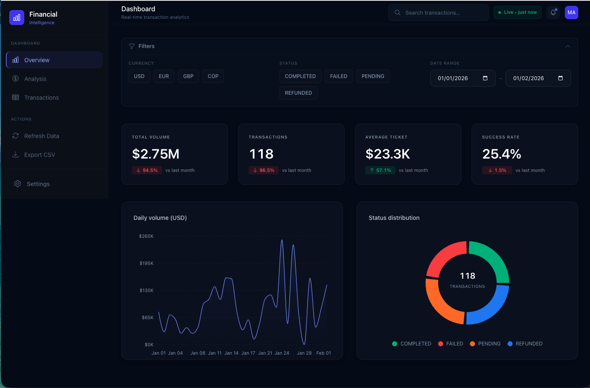

# SaaS Financial Intelligence

[**Live demo →**](https://proud-essence-production-fc99.up.railway.app)

[](https://proud-essence-production-fc99.up.railway.app)

> **Real-time transaction analytics platform with vector-based ETL.**  
> Designed for high-volume financial data integrity and decision-making.


---

## What this solves

Financial dashboards often fail on four fronts: messy or inconsistent source data, no real-time visibility into transactions, ETL pipelines that break or slow down at scale, and search and navigation that get in the way of finding answers. This project addresses all four—vectorized ETL for reliable ingestion, a single source of truth in PostgreSQL, and a dark-mode UI with smart search that switches context as you type so you stay in the flow.

---

## Highlights

| Feature | Description |
| :--- | :--- |
| **Smart search UX** | Auto-context switching: typing in the header sends you to the Transaction Ledger and applies the filter in real time. No extra navigation; focus stays in the search box. |
| **Premium dark UI** | Glassmorphism-style layout inspired by Stripe/Linear. Clear visual hierarchy, semantic status colors, tabular numerals for amounts, and optional reduced motion. |
| **Financial integrity** | Decimal-safe handling and runtime multi-currency normalization (USD, EUR, GBP, COP) to USD. Defensive null handling so KPIs and tables stay consistent. |
| **High-performance ETL** | Pandas-based ingestion using vectorized operations. Clean and load large datasets without slow iterative loops. |

---

## Stack (ADR)

| Layer | Choices | Rationale |
| :--- | :--- | :--- |
| **Frontend** | Next.js (App Router), Tailwind v4, Recharts, Framer Motion | App Router for data and layout; Tailwind for one source of truth; Recharts for full control over charts and tooltips; Framer Motion for transitions. |
| **Backend** | FastAPI (async), SQLAlchemy, Pydantic v2 | Async API, type-safe request/response, single DB engine. |
| **Data** | Pandas (ETL), PostgreSQL | Pandas for in-memory filter/aggregate; PostgreSQL as persistent store. Suitable for Railway or any Postgres host. |

---

## Quick start

**Prerequisites:** Python 3.10+, Node 18+, PostgreSQL. Optional: `.env` at repo root with `DATABASE_URL=postgresql://...`.

**1. Backend (API)**

```bash
cd backend
python -m venv venv && source venv/bin/activate   # Windows: venv\Scripts\activate
pip install -r requirements.txt
uvicorn main:app --reload --port 8000
```

API: **http://localhost:8000** — Docs: **http://localhost:8000/docs**

**2. Frontend (dashboard)**

```bash
cd frontend
cp .env.example .env.local   # optional: set NEXT_PUBLIC_API_URL if API is not localhost:8000
npm install
npm run dev
```

Dashboard: **http://localhost:3000**

If the backend is not running, the frontend shows demo data and a clear message instead of failing silently.

**Production (Railway):** In the frontend service, set `NEXT_PUBLIC_API_URL` to your backend URL **with `https://`** (e.g. `https://proyecto-1-saas-financial-intelligence-production.up.railway.app`). Then **redeploy the frontend**—Next.js bakes `NEXT_PUBLIC_*` at build time, so a new deploy is required for the change to take effect.

---

## Project structure

```
├── backend/             # FastAPI application
│   ├── main.py          # API endpoints and dashboard/transaction logic
│   └── requirements.txt
├── frontend/            # Next.js application
│   ├── src/app          # App Router pages and layout
│   └── src/components   # UI: charts, cards, filters, transaction table
├── etl_scripts/         # Data engineering
│   ├── etl_pipeline.py  # Clean and load into PostgreSQL
│   └── generate_data.py # Synthetic (dirty) data generator
└── requirements.txt    # Root dependencies for ETL
```

---

## ETL (optional)

From repo root, with `DATABASE_URL` set in `.env`:

```bash
pip install -r etl_scripts/requirements.txt   # or root requirements.txt
python etl_scripts/generate_data.py            # writes raw_transactions.json
python etl_scripts/etl_pipeline.py             # loads into PostgreSQL
python etl_scripts/verify_database.py          # sanity check
```

---

## API overview

| Method | Path | Purpose |
| :--- | :--- | :--- |
| GET | `/` | Health check |
| GET | `/api/dashboard` | KPIs, daily volume, status/currency/device breakdown, recent transactions. Query: `currencies`, `statuses`, `start_date`, `end_date` |
| GET | `/api/transactions` | Paginated transactions. Query: `limit`, `offset` |
| GET | `/api/filters` | Available filter options |

---

Real-time analytics with vectorized ETL, strict financial handling, and a UI built for decision-making, not demos.
